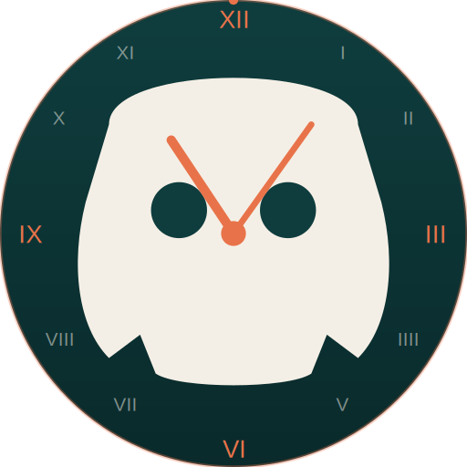
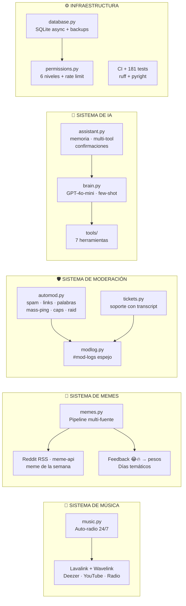
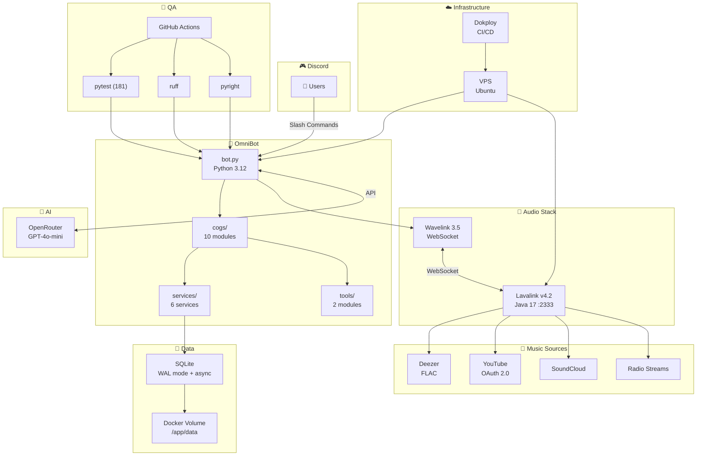
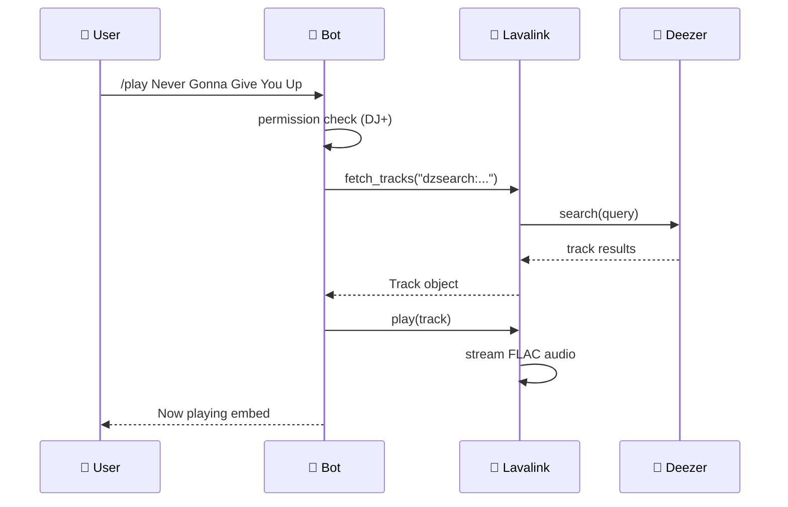
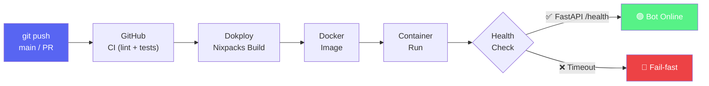

<div align="center">

<p align="center">
  
</p>


<br><br>

<h3 align="center">
  <samp>
    &gt; Discord Bot · Deezer Music · 24/7 Radio · Auto-Mod · XP · AI Assistant
  </samp>
</h3>

<p align="center">
  「 El bot todo-en-uno para tu comunidad de Discord 」
</p>

<p align="center">
  <i>Open Source · AGPL-3.0 — usalo, moldéalo, contribuí 🚀</i>
</p>

[](#-seguridad)
[](#-ci--tests)
[](#-ci--tests)
[](#deploy)
[](LICENSE)
[](#)

<br>


<br>

<p align="center">
  
  
  
  
  
  
  
  
</p>

<p align="center">
  
  
</p>

</div>

---

## 🤖 ¿Qué es OmniBot?

OmniBot es un **bot de Discord todo-en-uno** pensado para comunidades de juegos, streamers y grupos que quieren un servidor completo y bien moderado **sin esfuerzo de configuración**.

Es un "centro de operaciones" para tu servidor:

- 🎵 **Música Deezer FLAC + radio 24/7** con auto-reconexión.
- 🛡️ **Auto-moderación** (anti-spam, anti-raid, filtro de palabras, lockdown) + tickets de soporte.
- 📈 **XP / leveling** con roles de recompensa automáticos por nivel.
- 🤣 **Memes automáticos** (top del día, feedback por reacciones, meme de la semana).
- 🎮 **6 roles de juego autoasignables** + categorías y canales por juego.
- 🤖 **Asistente de IA** (GPT-4o-mini) que entiende lenguaje natural y ejecuta herramientas.

**39 comandos slash · 181 tests · CI con secret scanning** — un proyecto open source cuidado y seguro.

### Misión

> Darle a cualquier comunidad de Discord —desde un grupo de amigos hasta un servidor grande— todas las herramientas de gestión, entretenimiento y seguridad en un solo bot, sin configuración compleja ni costo.

### Visión

> Ser la alternativa **open source** de referencia para servidores de juegos y streamers: un proyecto mejorado por su comunidad, donde cada aporte expande lo que una comunidad puede lograr con su propio bot.

---

## 📑 Navegación Rápida

<div align="center">

[](#-overview)
[](#-features)
[](#-arquitectura)
[](#-comandos)
[](#-mapa-de-rutas-comando--archivo)
[](#-seguridad)
[](#-variables-de-entorno)
[](#deploy)
[](#-desarrollo-local)
[](#-ejemplos-didácticos)
[](#-contribuir)
[](SECURITY.md)

</div>

---

## 🚀 Quick Start

```bash
# 1) Cloná y entrá
git clone https://github.com/RubioKo/omni-bot.git
cd omni-bot

# 2) Dependencias + entorno
uv sync --frozen --extra dev
cp .env.example .env        # editá tu DISCORD_TOKEN (y opcionales: OPENROUTER_API_KEY, DEEZER_ARL...)

# 3) Lavalink + bot
cd lavalink && java -jar Lavalink.jar   # terminal 1 (requerido para música/radio)
python -m src.main                      # terminal 2
```

> 💡 **¿Vas a producción?** Deploy en **Dokploy con Nixpacks**: contenedor único con Lavalink incluido → [`🚀 Deploy`](#deploy). Documentación completa en [`🛠️ Desarrollo Local`](#-desarrollo-local).

---

## 🧭 Mapa Conceptual del Proyecto

Así se organiza OmniBot en 5 sistemas. Cada caja apunta al módulo real del repo.



### Los 5 sistemas en una tabla

| Sistema | Módulos | Qué resuelve | Ruta en el repo |
|---------|---------|--------------|-----------------|
| 🎵 Música | `cogs/music.py` + Lavalink | Radio 24/7, Deezer, auto-reconexión, canal solo-escuchar | [`src/cogs/music.py`](src/cogs/music.py) |
| 🤣 Memes | `services/memes.py` | Pipeline multi-fuente, feedback adaptativo, semana | [`src/services/memes.py`](src/services/memes.py) |
| 🛡️ Moderación | `cogs/automod.py` + `cogs/tickets.py` + `services/modlog.py` | Filtros automáticos, tickets, auditoría espejada | [`src/cogs/automod.py`](src/cogs/automod.py) |
| 🧠 IA | `services/brain.py` + `cogs/assistant.py` + `tools/` | Lenguaje natural → 7 herramientas con seguridad | [`src/services/brain.py`](src/services/brain.py) |
| ⚙️ Infra | `services/database.py` + `services/permissions.py` | Persistencia async, backups, permisos, resiliencia | [`src/services/database.py`](src/services/database.py) |

---

## 📋 Overview

<div align="center">
<table width="100%">
  <tr>
    <td width="50%" valign="top">

### 🤖 AI Assistant

Natural language powered by **GPT-4o-mini** via OpenRouter.

- Understands intent → executes tools (up to 3 per message)
- Conversation memory (last 5 turns, 10 min TTL)
- Knows the user's permission level (no forbidden proposals)
- 7 tools: moderation + server info
- Confirmation card for destructive actions (multi-action support)
- Natural responses composed by the AI after tool execution
- Fallback to rule-based matching if the AI is down

</td>
    <td width="50%" valign="top">

### 🎮 Built for Gamers

Comunidad multi-game con 6 títulos:

- Auto-assignable game roles via Select menus
- Per-game channels unlock automatically
- 6 categories, ~20 channels, 14 roles
- Community tools: LFG, coach corner, game nights
- Ticket support system (private channels + transcripts)
- Welcome DM generated dynamically (member count + game list)

</td>
  </tr>
</table>
</div>

---

## ✨ Features

<div align="center">
<table width="100%">
  <tr>
    <td align="center" width="25%">

### 🛡️ Auto-Mod

Anti-spam detection<br>
Link filter (subdomain-aware)<br>
Word filter (leetspeak-aware)<br>
Mass-ping protection<br>
Caps & emoji spam detection<br>
Anti-raid + auto-lockdown<br>
New-account flag (< 7 días)<br>
Progressive mute system<br>
Warn tracking (SQLite)<br>
Hierarchy checks (kick/ban)<br>
Mod-log espejado en Discord

</td>
    <td align="center" width="25%">

### 🎵 Music & Radio

Deezer playback (FLAC)<br>
24/7 radio (5 stations)<br>
Queue, skip, loop, volume<br>
Pause / Resume<br>
Radio auto-reconnect<br>
Auto-radio state persisted

</td>
    <td align="center" width="25%">

### ⚡ XP & Levels

+15-25 XP per message<br>
+20 XP / 5 min voice<br>
`/rank` `/top`<br>
Level-up DM + channel<br>
Level role rewards

</td>
    <td align="center" width="25%">

### 🔧 Server Tools

`/deploy` — Rebuild structure<br>
`/server-map` — Full map<br>
`/meme <1-3>` — Top memes<br>
`/guia` — Interactive guide<br>
Rules from single source

</td>
  </tr>
  <tr>
    <td align="center" width="25%">

### 🤖 AI Assistant

GPT-4o-mini via OpenRouter<br>
Up to 3 tools per message<br>
Memory (5 turns / 10 min)<br>
Rule-based fallback<br>
Confirmation cards

</td>
    <td align="center" width="25%">

### 🧪 CI & Tests

GitHub Actions on every push<br>
181 pytest tests<br>
Ruff lint (E/F/W)<br>
pyright type checking<br>
Coverage report<br>
Syntax + import checks<br>
Matrix: Python 3.11 / 3.12 / 3.13<br>
Pre-commit hooks (ruff + whitespace)

</td>
    <td align="center" width="25%">

### 📊 Permissions

6 levels: MEMBER → OWNER<br>
Role-based auto-detection<br>
Rate limiting per user<br>
Cooldown auto-pruning<br>
Dynamic command filtering

</td>
    <td align="center" width="25%">

### 🚀 Infrastructure

Nixpacks build (auto)<br>
FastAPI health check (:8080/health)<br>
Lavalink JVM capped (-Xmx256m)<br>
Retry logic (3 attempts)<br>
Docker volume persistence<br>
Async DB (no event-loop blocking)<br>
Daily DB backups (7-day retention)<br>
Task failure alerting (DM al owner)

</td>
  </tr>
</table>
</div>

---

## 🏗️ Arquitectura



### Flujo de un comando `/play`



---

## ⌨️ Comandos

<details open>
<summary><strong>🎵 Música (DJ+)</strong></summary>

| Comando | Descripción | Permiso |
|---------|-------------|---------|
| `/play <query>` | Reproducir de Deezer — si hay música sonando, se agrega a la cola; si suena la radio, la reemplaza | DJ |
| `/skip` | Saltar pista actual | DJ |
| `/stop` | Detener y desconectar | DJ |
| `/queue` | Ver cola de reproducción | DJ |
| `/np` | Ver qué suena ahora | DJ |
| `/volume <1-200>` | Ajustar volumen | DJ |
| `/loop` | Modo loop (off/track/queue) | DJ |
| `/pause` `/resume` | Pausar / Reanudar | DJ |
| `/disconnect` | Desconectar del voz | DJ |

</details>

<details>
<summary><strong>📻 Radio (Todos)</strong></summary>

| Comando | Descripción |
|---------|-------------|
| `/radio <station>` | Iniciar radio 24/7 |
| `/radiostop` | Detener radio y auto-radio |
| `/autoradio on\|off\|status` | Configurar auto-radio (Admin) |

| Estación | Género | Fuente |
|----------|--------|--------|
| `rock` | Rock Classics | ilovemusic.de |
| `lofi` | Lofi Hip Hop | streamafrica.net |
| `synthwave` | Synthwave | ilovemusic.de |
| `chill` | Chill Vibes | ilovemusic.de |
| `pop` | Pop Hits | ilovemusic.de |

</details>

<details>
<summary><strong>🛡️ Moderación (MOD+)</strong></summary>

| Comando | Descripción | Permiso |
|---------|-------------|---------|
| `/kick @user razon:` | Expulsar miembro | MOD |
| `/ban @user razon:` | Banear miembro | MOD |
| `/unban user_id:` | Desbanear por ID | MOD |
| `/warnings @user` | Ver warnings activos | MOD |
| `/clearwarnings @user` | Limpiar warnings | MOD |
| `/modlog` | Registro de moderación | MOD |
| `/modwords` | Ver palabras filtradas | MOD |
| `/lockdown` | Bloquear/desbloquear canales | MOD |
| `/reglas` | Publicar reglas (fuente única) | MOD |

</details>

<details>
<summary><strong>⚡ XP & Levels (Todos)</strong></summary>

| Comando | Descripción |
|---------|-------------|
| `/rank` | Tu nivel y XP |
| `/rank @user` | Perfil de otro usuario |
| `/top` | Top 10 leaderboard |

</details>

<details>
<summary><strong>🌐 Community (Todos)</strong></summary>

| Comando | Descripción |
|---------|-------------|
| `/poll pregunta: opciones:` | Crear encuesta con reacciones |
| `/giveaway premio: duracion: ganadores:` | Sorteo con reacciones (MOD+) |
| `/remind tiempo: mensaje:` | Recordatorio programado |
| `/meme` | Meme del top del día (MOD+) |
| `/guia` | Guía interactiva del servidor |
| `/comandos` | Lista de comandos filtrada por rol |
| `/ping` | Latencia del bot |
| `🎫 Abrir Ticket` | Sistema de soporte: botón → modal → canal privado con staff, cierre con transcript en #mod-logs |

</details>

<details>
<summary><strong>🔧 Admin (OWNER)</strong></summary>

| Comando | Descripción |
|---------|-------------|
| `/deploy` | Reconstruir 6 categorías + ~20 canales |
| `/nuke-all` | Destruir todo y reconstruir desde cero (con confirmación) |
| `/server-map` | Mapa completo del servidor |
| `/restart-bot` | Reinicio remoto |
| `/repostroles` | Repost menús de selección de roles |
| `/xplb` | Reinicializar base de datos |
| `/ticketpanel` | Publicar panel de tickets (ADMIN) |
| `/musiconly` | Canal de radio solo-escuchar (miembros sin micrófono ni chat) |

</details>

---

## 🗺️ Mapa de Rutas (Comando → Archivo)

Cada comando del bot con su ruta exacta en el código, para verificar de forma óptima y oportuna.

| Comando | Nivel | Archivo |
|---------|-------|---------|
| `/play` `/skip` `/stop` `/queue` `/np` `/volume` `/loop` `/pause` `/resume` `/disconnect` | DJ+ | [`src/cogs/music.py`](src/cogs/music.py) |
| `/radio` `/radiostop` `/autoradio` `/musiconly` | Todos / Admin | [`src/cogs/music.py`](src/cogs/music.py) |
| `/meme <1-3>` | MOD+ | [`src/cogs/info.py`](src/cogs/info.py) |
| `/kick` `/ban` `/unban` `/warnings` `/clearwarnings` `/modlog` `/modwords` `/lockdown` | MOD+ | [`src/cogs/automod.py`](src/cogs/automod.py) |
| `/ticketpanel` + botón 🎫 | Admin / Todos | [`src/cogs/tickets.py`](src/cogs/tickets.py) |
| `/poll` `/giveaway` `/remind` | Todos / MOD+ | [`src/cogs/community.py`](src/cogs/community.py) |
| `/rank` `/top` `/xplb` | Todos / Owner | [`src/cogs/levels.py`](src/cogs/levels.py) |
| `/guia` `/reglas` `/comandos` `/ping` | Todos | [`src/cogs/info.py`](src/cogs/info.py) |
| `/deploy` `/server-map` `/restart-bot` `/repostroles` | Owner | [`src/cogs/setup.py`](src/cogs/setup.py) |
| Mencionar al bot (`@OmniBot ...`) | Todos | [`src/cogs/assistant.py`](src/cogs/assistant.py) |

### Herramientas de IA (function calling)

| Herramienta | Qué hace | Nivel | Archivo |
|-------------|----------|-------|---------|
| `warn_user` `mute_user` `unmute_user` `clear_messages` `set_slowmode` | Moderación | MOD+ / ADMIN | [`src/tools/moderation.py`](src/tools/moderation.py) |
| `get_server_stats` `get_user_info` | Info del servidor | Todos | [`src/tools/info.py`](src/tools/info.py) |

### Tareas automáticas (loops 24/7)

| Tarea | Frecuencia | Qué hace | Archivo |
|-------|-----------|----------|---------|
| `daily_meme` | 30 min (dispara según `MEME_HOURS`) | Memes automáticos + semanal | [`src/bot.py`](src/bot.py) |
| `db_backup` | 24 h | Backup SQLite + retención | [`src/bot.py`](src/bot.py) |
| `voice_xp_loop` | 5 min | XP de voz | [`src/cogs/levels.py`](src/cogs/levels.py) |
| `check_giveaways` / `check_reminders` | 30 s | Sorteos y recordatorios | [`src/cogs/community.py`](src/cogs/community.py) |
| `report_task_error` | bajo demanda | DM al owner si una tarea falla 3+ veces | [`src/bot.py`](src/bot.py) |

---

## Seguridad

> [!IMPORTANT]
> Post-auditoría completa (Agosto 2026), el bot tiene blindaje total de secrets y validación de inputs.

| Medida | Estado | Detalle |
|--------|--------|---------|
| Secrets en env vars | ✅ | `DISCORD_TOKEN`, `OPENROUTER_API_KEY`, `DEEZER_ARL`, `DEEZER_MASTER_KEY`, `YOUTUBE_OAUTH_REFRESH_TOKEN` |
| `.gitignore` blindado | ✅ | `.env`, `data/`, `*.db`, `application.yml` excluidos; la plantilla pública es `.application.yml.example` |
| Tool param validation | ✅ | Schema definido por tool + `validate_tool_params()` antes de ejecutar |
| Error sanitization | ✅ | Exceptions se loggean, nunca se envían raw al usuario |
| Rate limiting | ✅ | Cooldowns por usuario con check+increment atómico |
| Ban/Kick hierarchy | ✅ | No se puede sancionar a roles iguales o superiores |
| Health check FastAPI | ✅ | `/health` en :8080, `HEALTH_CHECK_PORT` configurable |
| CI en cada push | ✅ | Sintaxis + imports + ruff + pyright + 181 tests antes de cualquier merge |

### Variables de Entorno (Dokploy)

```env
# 🤖 Discord
DISCORD_TOKEN=tu_token_de_discord

# 🧠 AI
OPENROUTER_API_KEY=tu_api_key_de_openrouter
OPENROUTER_MODEL=openai/gpt-4o-mini

# 🎵 Music
DEEZER_MASTER_KEY=
DEEZER_ARL=tu_arl_de_deezer
YOUTUBE_OAUTH_REFRESH_TOKEN=tu_refresh_token_de_youtube
LAVALINK_URI=http://127.0.0.1:2333
LAVALINK_PASSWORD=changeme

# 📻 Auto-Radio
AUTORADIO_CHANNEL_ID=0
AUTORADIO_STATION=rock

# 🤣 Memes
MEME_SUBREDDITS=memes,dankmemes,me_irl,gaming
MEME_HOURS=10,18
MEME_THEME_DAYS=0:gaming,2:dark,4:futbol
MEME_TIMEZONE=America/Argentina/Buenos_Aires

# 🗄️ Base de datos (volumen persistente)
OMNIBOT_DB_DIR=/app/data
```

| Variable | Default | Descripción |
|----------|---------|-------------|
| `DISCORD_TOKEN` | *(requerido)* | Token del bot de Discord |
| `OPENROUTER_API_KEY` | *(vacío)* | Si está vacío, el bot usa modo básico (rule-based) |
| `LAVALINK_URI` | `http://127.0.0.1:2333` | URI del nodo Lavalink |
| `LAVALINK_PASSWORD` | `changeme` | Debe coincidir con la config de Lavalink (generada desde `.application.yml.example`) |
| `AUTORADIO_CHANNEL_ID` | `0` | Canal de voz fijo de la radio 24/7 (`0` = desactivada) |
| `AUTORADIO_STATION` | `rock` | Estación por defecto de la radio |
| `MEME_SUBREDDITS` | `memes,dankmemes,me_irl,gaming` | Pool de subreddits para memes |
| `MEME_HOURS` | `10,18` | Horas de publicación de memes automáticos (2/día) |
| `MEME_THEME_DAYS` | `0:gaming,2:dark,4:futbol` | Días temáticos (0=lunes, 2=miércoles, 4=viernes) |
| `MEME_TIMEZONE` | `America/Argentina/Buenos_Aires` | Zona horaria (IANA) para las horas de memes |
| `DEEZER_MASTER_KEY` | *(vacío)* | Clave de descifrado estática/pública de Deezer requerida por LavaSrc (se provee por env) |
| `DEEZER_ARL` | *(vacío)* | **ARL de TU cuenta Deezer** (F12 > Cookies) — requerida por LavaSrc para FLAC |

> 🎵 **Deezer & tu cuenta**: el bot usa tu `DEEZER_ARL` para calidad FLAC via LavaSrc. Para correrlo no metas la cuenta de nadie más: **cada quien provee su propio ARL** (obtenelo de tu sesión de Deezer). OmniBot no usa ni necesita credenciales relaciones con cuentas del proyecto.
| `REDDIT_CLIENT_ID` | *(vacío)* | OAuth opcional (requiere aprobación manual de Reddit) |
| `REDDIT_CLIENT_SECRET` | *(vacío)* | Sin credenciales, el bot usa el RSS público (top del día) |
| `OMNIBOT_DB_DIR` | `./data` | Ruta de la base SQLite (montar volumen) |
| `LOG_LEVEL` | `INFO` | Nivel de logging (`DEBUG`, `INFO`, `WARNING`, `ERROR`) |
| `BANNED_WORDS` | *(vacío)* | Palabras extras para el filtro de auto-mod (separadas por coma) |
| `RAID_AUTO_LOCKDOWN` | `1` | `1` = bloqueo automático de canales ante raid, `0` = solo alerta |
| `MIN_ACCOUNT_AGE_DAYS` | `7` | Edad mínima de cuenta para no marcar sospechosa |
| `BACKUP_RETENTION_DAYS` | `7` | Días de retención de backups de la DB |
| `STATUS_API_TOKEN` | *(vacío)* | Token de `/api/status` (vacío = el endpoint responde 404) |
| `HEALTH_CHECK_PORT` | `8080` | Puerto del health check FastAPI |

---

## 🚀 Deploy

OmniBot corre en un **solo contenedor** gracias a **Nixpacks**, que descarga Lavalink + plugins al build. Cada operador lo despliega en **su propia infraestructura** y lo adapta a su medida.

> 💡 **Importante (honestidad del proyecto):** hoy la forma **recomendada y soportada** de desplegar es a través de **Dokploy/Nixpacks** en un solo contenedor. Las implementaciones para **entornos locales y/o manuales** (Docker directo, systemd, etc.) se irán documentando y mejorando con el tiempo, gratis para toda la comunidad, a medida que evolucionamos el bot. Podés [🚀 Quick Start](#-quick-start) para una corrida local rápida de desarrollo.

### Flujo de Deploy



### Pasos (Dokploy / Nixpacks)

1. Conectá tu repo (puede ser un **fork** de `RubioKo/omni-bot` o el tuyo propio)
2. Build type: **Nixpacks** (auto-detectado)
3. Seteá las env vars en la pestaña **Environment** (ver [Variables de Entorno](#-variables-de-entorno))
4. Montá el volumen `omnibot_data` en `/app/data` (persistencia de DB)
5. Auto-deploy en push a `main`

> [!TIP]
> El build descarga automáticamente Lavalink v4.2.2 + plugins (YouTube + LavaSrc) y arranca todo en un solo contenedor. La configuración de Lavalink se genera desde la plantilla `.application.yml.example` (placeholders a env vars; el password por defecto es `changeme` **— cambiálo y que coincida con `LAVALINK_PASSWORD`**). El CI de GitHub corre antes y bloquea merges con errores.

### 🎛️ Personalización (qué tocar dónde)

Cada comunidad adapta OmniBot a su medida. Esta tabla indica dónde se configura cada cosa:

| Qué querés cambiar | Dónde | Forma |
|---|---|---|
| Roles de juego, categorías y canales | `src/cogs/setup.py` (arrays de `categories`) + `/deploy` | Código + comando en Discord |
| Reglas del servidor | `src/services/rules.py` | Código (fuente única) |
| Memes (subreddits, horarios, temas) | env vars `MEME_*` + `src/services/memes.py` | `.env` / código |
| Asistente de IA (modelo, prompt, tools) | env `OPENROUTER_MODEL` + `src/services/brain.py` (SYSTEM_PROMPT) + `src/tools/` | `.env` / código |
| Radio 24/7 y estaciones | env `AUTORADIO_*` + `src/cogs/music.py` (`RADIO_STREAMS`) | `.env` / código |
| Auto-moderación (palabras, anti-raid, edad mínima) | env `BANNED_WORDS`, `RAID_AUTO_LOCKDOWN`, `MIN_ACCOUNT_AGE_DAYS` | `.env` |
| Niveles / XP / recompensas | `src/cogs/levels.py` (`LEVEL_ROLES`, `VOICE_XP_*`) | Código |
| Permisos por rol (staff) | `src/services/permissions.py` | Código |
| Mensaje de bienvenida | `src/cogs/welcome.py` | Código |

### ✅ Checklist post-deploy

- [ ] Cambiaste `LAVALINK_PASSWORD` (nunca el default `changeme`) y coincide con la env var.
- [ ] `/health` responde `200` en el Health Check.
- [ ] Los slash commands se sincronizaron (primer arranque).
- [ ] Lavalink conectó (probá `/play` o `/radio`).
- [ ] El volumen `/app/data` persiste la base de datos entre reinicios.

---

## 🛠️ Desarrollo Local

### Requisitos

- Python 3.12+
- [uv](https://docs.astral.sh/uv/) (package manager)
- Un bot de Discord creado en el [Discord Developer Portal](https://discord.com/developers/applications)

### Instalación

```bash
# 1. Clonar el repo
git clone https://github.com/RubioKo/omni-bot.git
cd omni-bot

# 2. Instalar uv (si no lo tenés)
pip install uv

# 3. Instalar dependencias (producción + desarrollo)
uv sync --frozen --extra dev

# 4. Activar el entorno virtual
source .venv/bin/activate     # Linux/macOS
.venv\Scripts\activate        # Windows

# 5. Configurar el .env
cp .env.example .env          # Linux/macOS
copy .env.example .env        # Windows
# ...editar .env con tu DISCORD_TOKEN

# 6. Instalar pre-commit hooks
pre-commit install

# 7. Arrancar Lavalink (en otra terminal)
cd lavalink && java -jar Lavalink.jar

# 8. Arrancar el bot
python -m src.main
```

### CI & Tests

```bash
# Correr los tests (181)
uv run pytest -v

# Lint con ruff
uv run ruff check src/ tests/

# Arreglar automáticamente issues de lint
uv run ruff check --fix src/ tests/

# Type check con pyright
uv run pyright src/

# Chequear sintaxis de todo el proyecto
uv run python -m compileall -q src/ tests/
```

El mismo flujo corre en **GitHub Actions** en cada push a `main` (`.github/workflows/ci.yml`).

---

## 📚 Ejemplos Didácticos

### 1. Agregar un comando nuevo

Todos los comandos son **slash commands** (`/...`): no hay comandos por prefijo. Viven en los cogs y se registran con `@app_commands.command`. Ejemplo real (`/ping`, de [`src/cogs/info.py`](src/cogs/info.py)):

```python
# src/cogs/info.py
import discord
from discord import app_commands
from discord.ext import commands

class InfoCog(commands.Cog):
    def __init__(self, bot):
        self.bot = bot

    @app_commands.command(name="ping", description="Ver latencia del bot")
    async def ping_cmd(self, interaction: discord.Interaction):
        latency = round(self.bot.latency * 1000)
        await interaction.response.send_message(f"🏓 Pong! Latencia: **{latency}ms**")

async def setup(bot):
    await bot.add_cog(InfoCog(bot))
```

Después registrá el cog en `src/bot.py` → `setup_hook()`:

```python
await self.load_extension("src.cogs.info")
```

> [!NOTE]
> Los slash commands se sincronizan automáticamente una sola vez al arrancar (guarda `_ready_done`). No hace falta tocar Discord.

### 2. Agregar un tool de IA nuevo

El bot tiene 4 lugares conectados: definición para la IA, la implementación, el registro en el mapa y el schema de validación.

```python
# 1. Definición para la IA (src/services/brain.py)
TOOL_DEFINITIONS.append({
    "type": "function",
    "function": {
        "name": "get_server_stats",
        "description": "Obtener estadísticas del servidor",
        "parameters": {"type": "object", "properties": {}}
    }
})

# 2. Implementación (src/tools/info.py)
async def get_server_stats(bot, message, params: dict) -> str:
    guild = message.guild
    return (
        f"📊 **{guild.name}**\n"
        f"👥 Miembros: {guild.member_count}\n"
        f"💬 Canales: {len(guild.channels)}"
    )

# 3. Registro en el mapa (src/cogs/assistant.py)
from ..tools.info import get_server_stats

TOOL_MAP = {
    # ...
    "get_server_stats": get_server_stats,
}

# 4. Schema de validación
TOOL_PARAM_SCHEMAS = {
    # ...
    "get_server_stats": {"required": [], "optional": []},
}
```

Un usuario escribe: `@OmniBot cuántos miembros hay en el servidor?` → la IA detecta la intención → ejecuta `get_server_stats` → responde en español.

### 3. Usar la base de datos (async)

```python
from ..services import database as db

# Todas las funciones son async y no bloquean el event loop
result = await db.add_xp(user_id, 25)          # {"gained": True, "xp": ..., "level": ...}
level = await db.get_level(user_id)             # {"user_id": ..., "xp": ..., "level": ...}
await db.set_setting("mi_clave", "mi_valor")    # key-value persistente
valor = await db.get_setting("mi_clave")
```

### 4. Verificar permisos

```python
from ..services.permissions import permission_manager

if not permission_manager.has_permission(ctx.author, "warn_user"):
    await ctx.send("Necesitas permisos de **MODERADOR** para usar este comando.")
    return

# Nombre legible del nivel requerido para mensajes de error
required = permission_manager.get_required_level_name("warn_user")  # "MODERADOR"
```

### 5. Diálogo de ejemplo con el bot

```
👤 Usuario:  @OmniBot silenciá a @Troll por 30 minutos
🤖 Bot:      ⏳ Ejecutando...
🤖 Bot:      🔇 @Troll silenciado por 30m. Razón: sin especificar

👤 Usuario:  @OmniBot cuántos miembros hay en el servidor?
🤖 Bot:      📊 **Mi Servidor** — 👥 145 miembros · 💬 30 canales
```

---

## 📂 Estructura del Proyecto

```
omni-bot/
├── .github/
│   ├── workflows/ci.yml         # CI: lint + pyright + tests (matrix 3.11-3.13)
│   ├── dependabot.yml           # Auto-update deps (pip + actions)
│   ├── CODEOWNERS               # Owner: @RubioKo
│   ├── ISSUE_TEMPLATE/          # Bug report + Feature request
│   └── PULL_REQUEST_TEMPLATE.md # PR checklist
├── 🐍 src/
│   ├── main.py                  # Entry point + dictConfig logging
│   ├── bot.py                   # Bot class, cog loader, Lavalink retry
│   ├── config.py                # Env vars con parsing defensivo (_env_int)
│   ├── py.typed                 # PEP 561 marker
│   ├── cogs/
│   │   ├── assistant.py         # AI brain (GPT-4o-mini) + confirmaciones
│   │   ├── automod.py           # Anti-spam, links, raid + kick/ban
│   │   ├── community.py         # /poll, /giveaway, /remind
│   │   ├── tickets.py           # Sistema de tickets (panel, modal, transcript)
│   │   ├── levels.py            # XP, leveling, voice XP (task)
│   │   ├── music.py             # Deezer + radio + auto-reconnect
│   │   ├── welcome.py           # Welcome DM dinámico + auto-role
│   │   ├── setup.py             # /deploy, /server-map, /repostroles
│   │   ├── roles.py             # Self-assignable roles
│   │   └── info.py              # /guia, /reglas, /comandos, /ping
│   ├── services/
│   │   ├── brain.py             # AI model + fallback rule-based + few-shot
│   │   ├── permissions.py       # 6 niveles + rate limiting atómico
│   │   ├── database.py          # SQLite async + backups
│   │   ├── memes.py             # Pipeline multi-fuente + feedback + semana
│   │   ├── modlog.py            # Espejo #mod-logs compartido
│   │   └── rules.py             # Reglas del servidor (fuente única)
│   ├── utils/
│   │   ├── members.py           # Resolver: mención > exacto > prefijo > substring
│   │   └── helpers.py           # parse_duration (días/horas/min/seg → segundos)
│   ├── tools/
│   │   ├── moderation.py        # Warn, mute, clear, slowmode
│   │   └── info.py              # Server stats, user info
│   └── web/
│       └── app.py               # FastAPI health check (/health, /api/status)
├── 🧪 tests/                    # 181 tests pytest
├── 📋 .application.yml.example  # Plantilla de config Lavalink v4 (placeholders a env)
├── 📄 Dockerfile                # Build alternativo (python:3.12-slim)
├── 🔧 nixpacks.toml             # Build + Lavalink + FastAPI health check
├── 🐍 pyproject.toml            # PEP 621 metadata + ruff + pytest + pyright
├── ⚙️ ruff.toml                 # Config de Ruff (lint)
├── 🔒 uv.lock                   # Lockfile (uv)
├── 🪝 .pre-commit-config.yaml   # ruff + trailing-whitespace + yaml check
├── 📦 requirements.txt          # Export (backwards compat)
├── 📦 requirements-dev.txt      # Deps de desarrollo
├── 📝 .env.example
├── 📖 README.md
├── 📖 AGENTS.md                 # Guía para agentes de IA
├── 📖 CONTRIBUTING.md           # Guía de contribución
└── 📖 CHANGELOG.md              # Registro de cambios
```

---

## 🏗️ Tech Stack

<div align="center">

### Core


### Audio & AI


### Infrastructure


### QA


</div>

---

## 📊 Roadmap

- [x] AI Assistant (GPT-4o-mini via OpenRouter)
- [x] Deezer Music Player (FLAC quality)
- [x] 24/7 Radio (5 stations, auto-reconnect)
- [x] Slash commands (39 commands)
- [x] Auto-Moderation (spam, links, raid)
- [x] Kick / Ban / Unban commands con jerarquía
- [x] XP / Leveling System (sin double-counting)
- [x] Role-Based Permissions (MEMBER → OWNER)
- [x] Server Deploy / Nuke System
- [x] Memes 2/día: top del día vía RSS público de Reddit (sin auth) + rotación + anti-repetición (historial 30 días)
- [x] Feedback adaptativo: reacciones 😂🔥💀 pesan las fuentes automáticamente
- [x] 🏆 Meme de la semana (lunes): el más reaccionado con corona
- [x] Días temáticos: lunes gaming · miércoles dark · viernes fútbol
- [x] Botón "🔄 Otro meme" (3 rerolls/hora) y videos mp4 en el pipeline
- [x] Polls / Giveaways / Reminders
- [x] Auto Miembro on Join (DM dinámico)
- [x] Security audit (env vars, validation, sanitization)
- [x] Async database (asyncio.to_thread + indexes)
- [x] GitHub Actions CI + 181 tests + ruff lint + pyright
- [x] Auto-radio state persistente (respeta `/autoradio off`)
- [x] Reglas del servidor desde fuente única
- [x] Sistema de tickets (modal + canal privado + transcript en #mod-logs)
- [x] uv package manager + pyproject.toml (PEP 621)
- [x] FastAPI health check (/health, /api/status)
- [x] Pre-commit hooks (ruff + trailing-whitespace + yaml)
- [x] GitHub issue/PR templates + CODEOWNERS
- [x] Logging dictConfig + optional RotatingFileHandler

---

## 🚀 Implementaciones Futuras

Ideas coherentes con la arquitectura actual (cogs + slash commands + SQLite async + tasks 24/7 + AI tools). Cada una es implementable de forma incremental sin reescribir el bot.

| # | Idea | Qué resuelve | Dónde encaja |
|---|------|--------------|--------------|
| 1 | **Memes por DM (suscripción)** | Recibir el meme del día por mensaje directo sin spamear el servidor | Task nueva en `bot.py` + `db.setting` por usuario + reutilizar `get_daily_meme()` |
| 2 | **Export de warns (CSV)** | Exportar el historial de warns/kicks/bans de un miembro para el staff | Comando en `automod.py` + queries de `database` + `discord.File` |
| 3 | **Roles de nivel configurables** | Editar `LEVEL_ROLES` por servidor vía `/level-rewards` | `db.setting` + Select en `levels.py` |
| 4 | **Recordatorios recurrentes** | `remind` diario/semanal con patrón simple (`1d`, `2h`) | Extender `community.py` + task `check_reminders` |
| 5 | **Anti-raid con verificación (botón)** | Canal de verificación + botón que otorga `Miembro` (reduce raids de cuentas nulas) | `welcome.py` + view todo-en-uno persistente |
| 6 | **Apelar un warn por ticket** | Ticket de apelación que abre con el contexto del warn | Puente entre `tickets.py` y un nuevo comando en `automod.py` |
| 7 | **Favoritos de música (`/fav`)** | Lista de canciones del usuario para encolar en 1 comando | Tabla SQLite nueva + `music.py` |
| 8 | **Más tools de IA para staff** | `add_role`, `list_warnings` y `unban` por chat natural | Entry en `TOOL_MAP` + `TOOL_DEFINITIONS` + schema en `assistant.py` |
| 9 | **Dashboard web de estado** | Página HTML en el health check con stats y uptime del servidor | Extender `web/app.py` + `get_server_stats()` |
| 10 | **Multi-radio por canal** | Dos canales de voz con radios distintas en paralelo | Estado por guild en `music.py` |

---

## 🤝 Contribuir

OmniBot es **código abierto (AGPL-3.0)** y todo aporte suma valor:

- 🎮 6 roles de juego autoasignables (Valorant, Fortnite, LoL, Arena Breakout, Genshin, HotS)
- 🛡️ Sistema completo de moderación + tickets
- 🎵 Música Deezer FLAC + radio 24/7
- 🤖 Asistente de IA para tu comunidad
- 📊 XP, memes y herramientas de servidor

### Cómo participar

- Leé [`CONTRIBUTING.md`](CONTRIBUTING.md) y la guía para asistentes de IA en [`AGENTS.md`](AGENTS.md).
- Reportá bugs / pedí features en **Issues**. Dudas y demos en **Discussions**.
- **Seguridad**: reportá en privado vía [`SECURITY.md`](SECURITY.md).
- **Conducta**: [`CODE_OF_CONDUCT.md`](CODE_OF_CONDUCT.md).

### 💖 Apoya el proyecto

Si OmniBot te resulta útil, tu apoyo ayuda a mantener el proyecto y a seguir mejorándolo **gratis para toda la comunidad**:

<p align="center">
  <a href="https://ko-fi.com/rubioko">
    
  </a>
  <a href="https://www.patreon.com/cw/RubioKo">
    
  </a>
</p>

### Comunidad

- 💬 **Comunidad de ejemplo (OmniBot en acción):** el servidor **PANDORUS** corre una instancia **privada y personalizada** de OmniBot — usala para ver el bot **100% operativo y en uso**, y comprobá lo que podés adaptar a tu propia comunidad.

> ℹ️ El servidor **PANDORUS** es un **ejemplo configurable y personalizado** de OmniBot. Su configuración se mantiene **de forma local y privada** y **no afecta** al proyecto ni a tu propio bot. Para usarlo de referencia o crear el tuyo con la misma personalización, seguí los pasos de [🚀 Deploy](#deploy) y adaptá roles, canales, memes y el asistente a tu medida.

>
> ➡️ Invitación de ejemplo: [discord.gg/9WTF5bpxk7](https://discord.gg/9WTF5bpxk7)
> *Cada servidor puede correr y mejorar su propio OmniBot — este solo muestra un caso de uso real.*

---

## 🔀 Flujo de desarrollo

- `main` es la rama por defecto; los cambios de la comunidad entran por **Pull Request**.
- Cada push/PR dispara CI: **Lint** (ruff + pyright) · **Test** (Python 3.11/3.12/3.13) · **Secret Scan** (gitleaks).
- Cambios que rompan compatibilidad (env vars, comandos, DB) se documentan en `CHANGELOG.md` y `README.md`.
- Cualquier secret que llegue al historial se considera comprometido → se rota y se purga.

---

## 📜 Licencia

**GNU AGPL-3.0** — código abierto.

Uso, estudio, modificación y redistribución permitidos; cualquier servicio o derivado basado en OmniBot debe publicar su código fuente bajo la misma licencia. Ver [`LICENSE`](LICENSE) para el texto completo.

© 2026 RubioKo — mantenido con ❤️ por su comunidad.

---

<div align="center">

**[⬆ Back to Top](#-navegación-rápida)**

</div>

<p align="center">
  <samp>
    OmniBot v1.0.0 — Open Source (AGPL-3.0) · Updated September 2026
  </samp>
</p>

<div align="center">
  <samp>Built with 💜 by RubioKo</samp>
</div>
